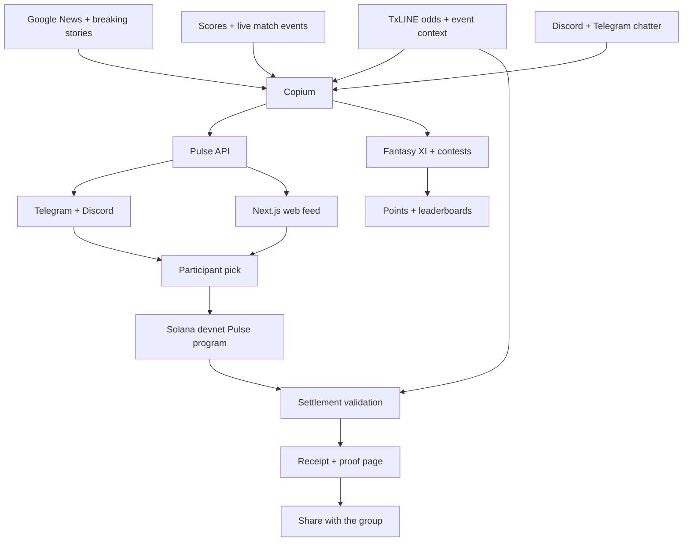

<p align="center">
  
</p>

# copium.fun

<p align="center">
  <strong>Your group chat has takes. Now it has a scoreboard.</strong>
</p>

copium.fun is a live sports prediction game that turns every match into an ongoing competition between friends, fans, and communities.

> **Watch the match → swipe on the moment → build your streak → beat the room → keep the receipt.**

## One match, three ways to play

### ⚡ Swipe on live Pulses

During a match, Copium identifies important moments and turns them into **Pulses**: 90-second YES/NO prediction markets such as “Will the next attack produce a shot?”, “Will Brazil score before half-time?”, or “Will this player receive a card?”

On the web, each Pulse appears in a Tinder-style card stack: swipe right for **YES**, swipe left for **NO**, and watch the moment unfold. The same position can be taken directly from a Telegram or Discord group by adding the Copium bot, so the game lives inside the conversation instead of pulling fans away from it.

### 🏆 Compete with friends and the world

Every correct prediction earns points, extends a streak, and moves the player up the global leaderboard. Fans can create private rooms for a fixture, invite friends, and compete on their own room leaderboard.

### ⚽ Build your Fantasy XI

For a longer strategic game, players can build a fantasy XI within a fixed budget, select a captain and vice-captain for scoring multipliers, and follow player performance throughout the same live match.

Pulse play rewards instinct in the moment. Fantasy rewards an understanding of the whole match. Rooms, streaks, leaderboards, and receipts turn both into an experience people want to replay with the same friends at the next kickoff.

## 🔗 Resolved with live data, settled on Solana

TxLINE and the TxODDS API provide the live fixture context, odds-derived Line, and event data used to create and resolve Pulses. Solana devnet records the position and settlement, turning a passing prediction into a shareable receipt with an inspectable outcome.

## The experience at a glance

| Before the match | During the match | After the moment |
|---|---|---|
| Join a fixture, create a private room, invite friends, and build a fantasy XI | Swipe on 90-second Pulses from the web, Telegram, or Discord while fantasy points update live | Extend a streak, move up global and room leaderboards, and share a receipt backed by the settlement record |

## Imagine a match in motion

It is the 78th minute. The score is 1–1. A winger gets space on the left. The score feed updates, a news alert starts circulating, and the Discord and Telegram conversations light up. Copium turns that burst of signal into a clean question:

> **COPIUM PULSES**
> 
> Brazil are building pressure.
> 
> **Will Brazil score in the next 90 seconds?**
> 
> Crowd: 64% YES · Line: 41% YES
> 
> [SWIPE YES] [SWIPE NO]
> 
> Pulse closes in **01:27**

Everyone gets one clean decision before the moment disappears. No spreadsheet, no ten-minute form, no scrolling through a separate betting interface. Just a question, a side, and a clock—wherever the conversation is happening.

When the window closes, the group gets the answer—and the receipts get personal:

> **CERTIFIED COPIUM ☠️**  
> You called YES at 64%. The match called NO.

or:

> **PROPHETIC ★★★**  
> You went against the Crowd early. The moment went your way.

Then, when the match moves from one moment to the next, the experience opens up. Someone goes to the fantasy tab and builds an XI from the players on the pitch. They have 100 credits, need 11 players, can select no more than 7 from one club, and choose a captain for 2× points and a vice-captain for 1.5×. Someone else joins the private room. Everyone watches the same match, but each person plays a different layer of it.

That combination—live context, instant choice, lineup strategy, public outcomes, and a little social shame—is the product.

## Make it your room

The best version of copium.fun is not a public lobby. It is the room you create five minutes before kickoff with the people who are already arguing about the match.

Create a private room for a fixture, choose the entry amount, share the invite, and let the group build its own competition. The room keeps the action match-scoped and personal:

- Invite friends with a shareable room link or code.
- Set a private entry and shared prize pool for the room.
- See who has joined and who is still watching from the sidelines.
- Follow room activity as picks land and streaks break.
- Compare points on a private leaderboard instead of getting lost in a global table.
- Let the same friends compete through Pulse picks, fantasy lineups, and match performance.

One room can feel like a group chat, a mini-league, and a live match control room at the same time. Your friend who always says “easy goal” now has to put a pick behind it. Your fantasy captain is no longer a private spreadsheet decision—it is part of the room’s running story.

## The problem: sports chat has no memory

Live sports conversation already happens in group chats, but the takes disappear as quickly as they arrive. Polls are slow, leaderboards are disconnected from the moment, and a confident prediction has no lasting proof.

copium.fun makes the moment itself the product. It gives a group four things that normal chat does not:

- **Fast:** every Pulse is designed to be answered in a few seconds.
- **Social:** the game meets people in the Telegram group, Discord server, or web feed they already use.
- **Time-bound:** a Pulse expires after 90 seconds, so there is no stale market to catch up on.
- **Verifiable:** the outcome and settlement path are backed by TxLINE and Solana devnet.
- **Shareable:** every pick can become a receipt—CERTIFIED COPIUM, PROPHETIC, BASED, or a straightforward win/loss.

The result is not trying to replace watching the match. It gives everyone something to do during the match that is lightweight enough for casual fans and competitive enough for the person who insists they “saw it coming.”

## The core loop


### 1. Signals arrive from everywhere

Copium is not waiting for one perfect feed. It combines the places fans already look: Google News and other news signals, live scores, match events, TxLINE context, Discord, Telegram, and community chatter. A goal, injury, card, substitution, score change, or breaking story can all become the trigger for a new Pulse.

The job is signal compression: turn a messy stream of updates into one sharp question that makes sense in the next 90 seconds.

Examples:

- “Will the next five minutes produce a goal?”
- “Will Brazil score before half-time?”
- “Does the next attack end in a shot?”

### 2. A Pulse opens wherever the fans are

The Pulse appears in the web feed and can be delivered into a Telegram group or Discord conversation with the match, question, countdown, and current **Crowd vs Line** split. Telegram and Discord are distribution surfaces; the live signal layer is what creates the moment in the first place. The Line is the market signal; the Crowd is what the people think.

### 3. People make a call

A participant swipes left for **NO** or right for **YES**. On the web experience, the same interaction is available as a swipeable card with a clear countdown and one-tap action buttons. Demo stakes use test tokens on Solana devnet.

### 4. The moment resolves

After 90 seconds, the underlying match signal is checked. The Pulse closes, the winning side is recorded, and each participant receives a result.

### 5. The receipt tells the story

The result is more than a score. It captures the pick, the Crowd vs Line gap, the match outcome, and the verification link. A bad call can be **CERTIFIED COPIUM**; an early contrarian hit can be **PROPHETIC**; a line-aligned win is **BASED**.

## Two ways to play the same match

### Pulse play: call the next thing

Pulse play is the instant loop. A card arrives, the clock is running, and you pick YES, NO, or skip. Correct picks add points, build a streak, affect your rank, and can contribute to a room or contest. The swipe is intentionally simple; the hard part is deciding whether your instinct is better than the Crowd.

### Fantasy play: build the whole story

The Fantasy surface is a Dream11-style match contest layered on top of the same live data:

- Build an XI from the match squad.
- Work within a 100-credit budget.
- Meet the positional rules: goalkeeper, defenders, midfielders, and forwards.
- Pick no more than 7 players from one club.
- Choose a captain for a 2× points multiplier.
- Choose a vice-captain for a 1.5× multiplier.
- Watch points update live as players act.
- Climb match, friends, weekly, supporters, and room leaderboards.

Pulse play asks **“what happens next?”** Fantasy play asks **“who is going to matter for the entire match?”** Together they turn one fixture into a stream of decisions instead of a single pre-match prediction.

## The product principles

### One moment, one decision

The interface is deliberately narrow. A participant should understand the question, see how the Crowd compares with the Line, and make a call without learning a trading terminal.

### Urgency without homework

The 90-second window creates urgency, but the user does not need to study a market or manage a position. The match supplies the context; 
Copium supplies the prompt.

### Social first, financial second

The first reason to participate is to be right in front of your friends. Devnet test-token settlement gives the result a real shared state for the prototype, but the emotional loop is the Discord or Telegram conversation, the leaderboard, the fantasy lineup, and the receipt.

### Funny on the surface, serious underneath

The feed is warm, playful, and a little ruthless. The proof page is precise: event data, timestamps, pool state, settlement information, and transaction links. The tone changes by surface because the jobs are different.

## What a Pulse contains

Every Pulse is small enough to fit in a Telegram message, but structured enough to settle:

| Field | Why it matters |
|---|---|
| Match and topic | Gives the pick immediate context |
| YES/NO question | Defines exactly what is being predicted |
| Open and close time | Makes the decision window unambiguous |
| Crowd percentage | Shows what participants are choosing |
| Line percentage | Shows the live comparison signal |
| Participant position | Records the side selected and the devnet stake |
| Resolution event | Defines how the winning side is determined |
| Receipt and proof link | Makes the outcome easy to share and inspect |

The same match can therefore be experienced in several modes: as a Pulse in the web feed, as a message in Telegram or Discord, as a fantasy lineup with live player points, and as a verifiable settlement record after the clock runs out.

## What you can use today

| Surface | What it does |
|---|---|
| **Match dashboard** | Shows live fixtures, score context, current rank, streak, balance, and the next action |
| **Pulse feed** | Shows open Pulses, countdowns, Crowd vs Line, and swipeable cards |
| **Fantasy** | Builds an 11-player lineup with credits, positional rules, captain/vice-captain multipliers, and live points |
| **Telegram + Discord** | Delivers the live question into existing communities instead of asking fans to find a new feed |
| **Rooms** | Create a private match league, set entry/prize details, invite friends, and follow room activity and standings |
| **Receipts** | Shareable result pages for individual picks |
| **Proof** | Settlement details, TxLINE data, Solana transactions, and downloadable proof data |

## copium.fun vs the usual options

| | Group chat poll | Sportsbook | Long-horizon prediction market | **copium.fun** |
|---|:---:|:---:|:---:|:---:|
| Starts from a live match moment | ◐ | ◐ | ◐ | **✓** |
| Fits inside the group conversation | **✓** | ✗ | ✗ | **✓** |
| Answerable in a few seconds | **✓** | ◐ | ✗ | **✓** |
| 90-second time window | ✗ | ✗ | ✗ | **✓** |
| Crowd vs Line shown together | ✗ | ◐ | ◐ | **✓** |
| Build a live fantasy XI | ✗ | ✗ | ✗ | **✓** |
| Captain and vice-captain strategy | ✗ | ✗ | ✗ | **✓** |
| Create a private room with friends | ✗ | ✗ | ✗ | **✓** |
| Match-scoped private leaderboard | ✗ | ✗ | ✗ | **✓** |
| Shareable result receipt | ✗ | ✗ | ✗ | **✓** |
| On-chain settlement proof | ✗ | ✗ | ◐ | **✓** |

They settle seasons. copium.fun settles the moment.

## Why TxLINE, TxODDS, and Solana matter

The product is intentionally simple for the person making a pick. The underlying system keeps the result auditable.

| Technology | Role in copium.fun | What breaks without it |
|---|---|---|
| **Google News and news signals** | Surfaces breaking stories and context that can become a playable match moment | The system only sees events after they have already become obvious in a score feed |
| **Live scores and match data** | Supplies the fixture, score, minute, player action, and event state behind the question | No reliable clock or event context for the 90-second window |
| **Discord + Telegram** | Distributes Pulses into communities where fans are already reacting | Fans have to leave the conversation to discover the next moment |
| **TxLINE / TxODDS API** | Supplies fixture state, live match signals, odds context, historical events, and the verification path used when a Pulse resolves | Copium cannot create timely Pulses, compare Crowd against Line, or resolve outcomes against a reliable reference |
| **Solana devnet** | Records Pulse pools, positions, settlement, and receipt-linked transactions | Picks remain an off-chain poll with no shared settlement state |
| **Anchor program** | Holds the binary Pulse lifecycle: create, open, lock, settle, and withdraw | There is no on-chain market lifecycle |
| **Next.js web app** | Provides the feed, swipe UI, rooms, proof pages, and receipt pages | No rich interface for browsing, picking, or verifying |

The important design choice is that the social interaction stays lightweight while the settlement record stays inspectable.

TxLINE is embedded in the product loop rather than exposed as a separate data screen. Its live context determines which moments are playable, its odds data creates the Line shown beside the Crowd, and its event history provides the reference used during resolution. copium.fun turns those signals into repeat interactions across the web, Telegram, Discord, private rooms, fantasy contests, and leaderboards.

### TxLINE integration map

| Integration surface | Where it is used | Role in the product |
|---|---|---|
| Authentication and API access | [`packages/txline/src/auth.ts`](packages/txline/src/auth.ts), [`packages/txline/src/env.ts`](packages/txline/src/env.ts) | Starts the TxLINE guest session and provides authenticated access to live sports data |
| Fixtures and live snapshots | [`packages/txline/src/snapshot.ts`](packages/txline/src/snapshot.ts), [`apps/web/lib/txline-live-context.ts`](apps/web/lib/txline-live-context.ts) | Supplies the fixtures, score, clock, and current match context visible in the product |
| Live event ingestion | [`packages/txline/src/sse.ts`](packages/txline/src/sse.ts), [`apps/txline-ingest/src/index.ts`](apps/txline-ingest/src/index.ts) | Streams match and odds updates into the Pulse pipeline |
| Pulse detection and creation | [`packages/txline/src/detect.ts`](packages/txline/src/detect.ts), [`apps/pulse-orchestrator/src/spawn.ts`](apps/pulse-orchestrator/src/spawn.ts) | Converts meaningful TxLINE updates into short-lived, match-aware Pulses |
| Crowd vs Line | [`packages/pulse-engine/src/spawner-llm.ts`](packages/pulse-engine/src/spawner-llm.ts), [`apps/agent-runtime/src/agents/officer.ts`](apps/agent-runtime/src/agents/officer.ts) | Turns odds-derived probability into the Line users compare their collective picks against |
| Outcome resolution | [`packages/settlement/src/score.ts`](packages/settlement/src/score.ts), [`packages/settlement/src/fetch-odds.ts`](packages/settlement/src/fetch-odds.ts) | Fetches the event timeline and validation data used to determine the winning side |
| Settlement execution | [`apps/settlement-worker/src/phase-a.ts`](apps/settlement-worker/src/phase-a.ts), [`apps/settlement-worker/src/phase-b.ts`](apps/settlement-worker/src/phase-b.ts) | Carries the verified result through the two-phase settlement flow and receipt creation |

The boundary is deliberate: TxLINE and TxODDS supply the live sports truth; Copium turns that truth into a social game; Solana preserves the resulting positions and settlement state.

### What is deliberately off-chain

The Telegram delivery, feed refresh, card animation, and social copy are product-layer concerns. They should feel instant and conversational. The Pulse lifecycle and settlement state are the parts that benefit from a shared, inspectable ledger.

That split keeps the experience simple: users interact with a familiar message and a familiar swipe gesture, while the system can still answer the important question afterward—what was the Pulse, when was it open, what signal resolved it, and who picked which side?

## Architecture



### On-chain lifecycle

The Anchor program in [`programs/copium-pulses`](programs/copium-pulses) models each Pulse as a short-lived binary pool:

1. Create the Pulse with its question and open/close times.
2. Accept a YES or NO position while the Pulse is open.
3. Lock the pool when the window expires.
4. Post the resolved result and settlement data.
5. Settle the winning side.
6. Allow eligible participants to withdraw their devnet test-token payout.

The public proof surface lives at `/proof/[pulseId]`; shareable human-readable results live at `/r/[receiptId]`.

## Demo path

The shortest judge path is:

1. Open the live match feed at `/feed`.
2. Choose an open Pulse.
3. Swipe the card or press **YES** / **NO**.
4. Sign the devnet transaction with a Solana wallet.
5. Open the resulting receipt.
6. Follow the proof link to inspect the settled Pulse and transaction data.

To show the full product surface:

1. Open the dashboard and choose a live fixture.
2. Create a private room, choose the entry and prize pool, and copy the invite.
3. Build an 11-player fantasy XI within the credit and club limits.
4. Set a captain and vice-captain, then enter the contest.
5. Return to Pulse play and call the next match event.
6. Watch points, streaks, room activity, standings, and receipts update around the same fixture.

For the intended social flow, post the same Pulse into a Telegram group or Discord server and let several people answer before the countdown expires.

> **Demo environment:** Solana devnet only. Stakes are test tokens; no real-money wagering is involved.

### The 90-second judge demo

For a memorable walkthrough, start with the social moment rather than the infrastructure:

1. Show the Telegram-style Pulse announcement: match context, question, Crowd vs Line, and countdown.
2. Open `/feed` and show the same Pulse as a swipeable card.
3. Make a YES or NO pick and sign the devnet transaction.
4. Let the fixture event advance until the Pulse closes.
5. Open the receipt and show the label generated from the pick and outcome.
6. Follow **Verified by TxLINE** into `/proof/[pulseId]` and show the settlement record.

The story should land in one sentence: **a live sports take started in chat, became a real Pulse, and ended with proof.**

Demo links:

- Web app: `[add deployed URL]`
- Telegram group or bot: `[add Telegram link]`
- Discord server or channel: `[add Discord link]`
- Demo video: `[add video link]`
- Example receipt: `[add receipt URL]`
- Example proof: `[add proof URL]`

## Repository map

| Path | Purpose |
|---|---|
| [`apps/web`](apps/web) | Next.js product surface, feed, rooms, receipts, proof pages, and API routes |
| [`apps/mobile`](apps/mobile) | Mobile match-feed experience with swipe interactions |
| [`apps/pulse-orchestrator`](apps/pulse-orchestrator) | Match-event and Pulse orchestration utilities |
| [`apps/txline-ingest`](apps/txline-ingest) | TxLINE event ingestion and replay tooling |
| [`apps/settlement-worker`](apps/settlement-worker) | Settlement and receipt processing |
| [`packages/txline`](packages/txline) | TxLINE subscription, verification, and event utilities |
| [`packages/settlement`](packages/settlement) | Settlement validation, hashes, Merkle data, and PDAs |
| [`packages/pulses-client`](packages/pulses-client) | Client helpers for creating, picking, and settling Pulses |
| [`packages/db`](packages/db) | Persistence for Pulses, rooms, participants, and receipts |
| [`programs/copium-pulses`](programs/copium-pulses) | Anchor program for Pulse pools and settlement |
| [`scripts`](scripts) | Local development, fixture seeding, simulation, and verification commands |

## Run it locally

### Requirements

- Node.js 20+
- pnpm 10+
- Docker, for the local Redis service
- A Solana wallet configured for devnet
- Supabase credentials for persisted feed and room data
- TxLINE credentials for live ingestion; the fixture simulator can be used for a repeatable demo

### Install

```bash
pnpm install
cp .env.example .env
```

Fill in the environment values required by the web app and data packages. Keep private keys and API tokens out of git.

### Start the local stack

```bash
pnpm db:migrate
pnpm redis:up
pnpm dev
```

The web app runs at `http://127.0.0.1:3000` unless the local configuration specifies another port.

To seed a development Pulse:

```bash
pnpm dev:seed
```

Useful checks:

```bash
pnpm lint
pnpm typecheck
pnpm build
pnpm verify:d21
```

To build the Anchor program directly:

```bash
pnpm anchor:build
```

## Current verification surface

- **Network:** Solana devnet
- **Signal inputs:** news, live scores, match events, Discord, Telegram, and TxLINE context
- **Settlement data:** TxLINE event and odds context
- **Program:** `copium-pulses` Anchor program
- **Fantasy surface:** 11-player lineups, 100-credit budget, club limits, captain/vice-captain scoring
- **Rooms:** private match leagues with invites, entry/prize details, activity, members, and head-to-head points
- **Proof UI:** `/proof/[pulseId]`
- **Receipt UI:** `/r/[receiptId]`
- **Wallet interaction:** Solana devnet transaction signing
- **Repeatable demo:** local fixture simulator and seed scripts

Before submission, add the concrete evidence below so judges can verify the live build in one click:

- Deployed web URL
- Telegram group or bot URL
- Demo video
- Solana program address and explorer link
- Example settled Pulse
- Example receipt and proof bundle
- Latest test/build output

## Product language

- **Pulse:** a 90-second YES/NO market on a live match moment.
- **Crowd:** the current split of participant picks.
- **The Line:** the live odds or probability signal used as the comparison point.
- **Copium gap:** the distance between Crowd and Line.
- **Room:** a match-scoped group for friends and head-to-head scoring.
- **Private room:** a friend-created match league with an invite, entry, shared prize pool, activity feed, and private standings.
- **Receipt:** a shareable result card linked to its verification record.
- **Fantasy XI:** an 11-player match lineup selected within credits and positional rules.
- **Captain / vice-captain:** lineup multipliers of 2× and 1.5× respectively.

## Status

copium.fun is a hackathon prototype running on Solana devnet. World Cup football is the first surface, but the interaction is designed for any live event where news arrives quickly and people want to call what happens next.

---

*copium.fun — the takes are hot, the window is short, and the receipt lasts.*
